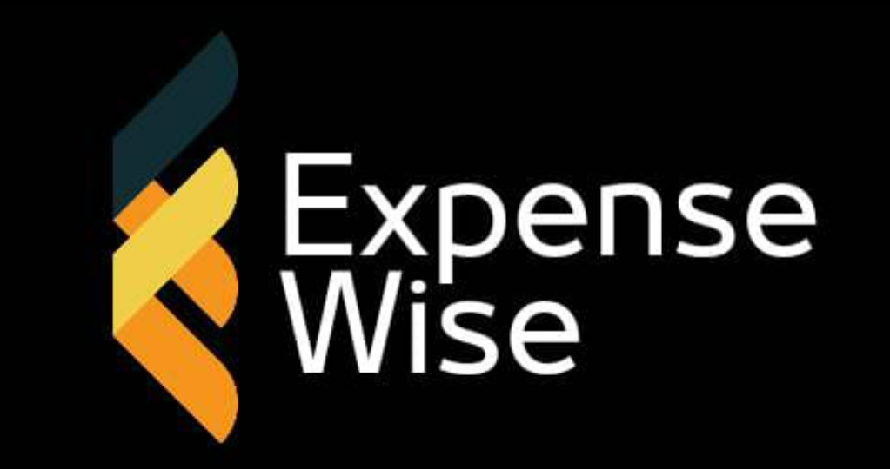
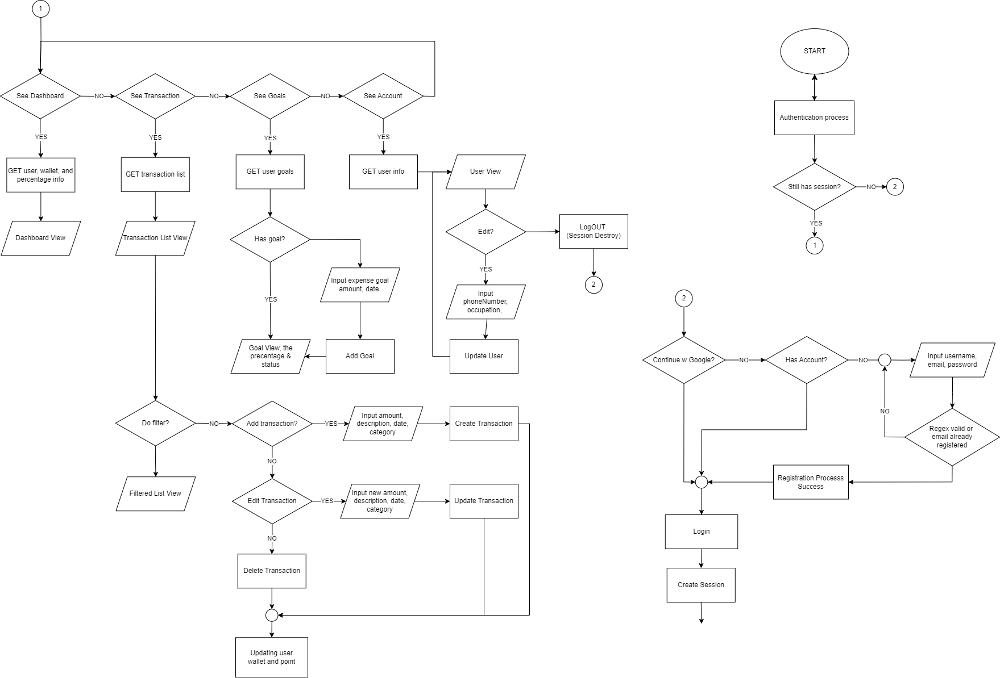
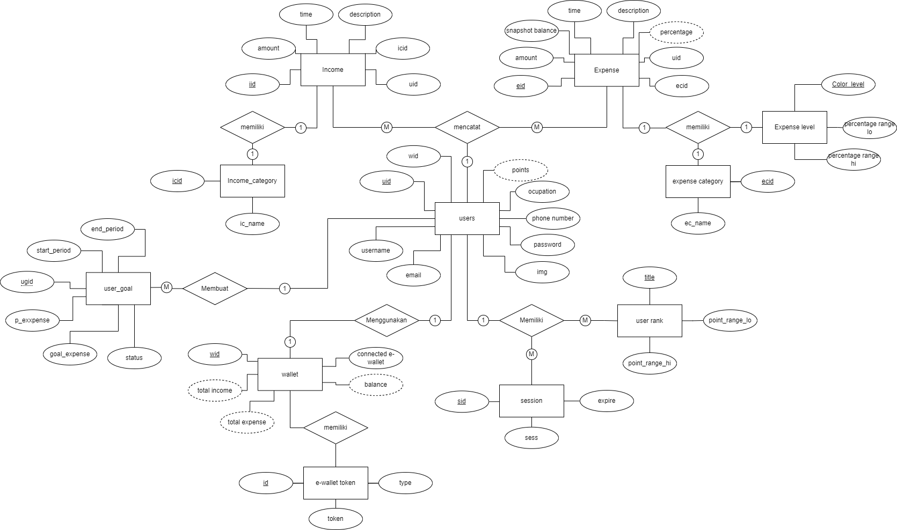
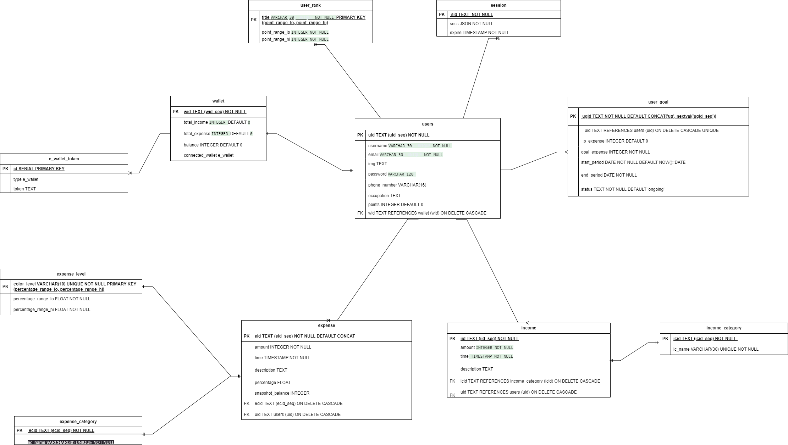

# ExpenseWise

ExpenseWise is an expense tracker app that helps you manage your finances and keep track of your expenses. It provides a user-friendly interface for recording transactions, setting goals, and analyzing your spending habits.

## Background

Managing personal finances can be a challenging task, especially when it comes to tracking expenses. ExpenseWise aims to simplify this process by providing an intuitive mobile app that allows users to easily record their expenses and analyze their financial activities.

## Flowchart

The flowchart above illustrates the basic flow of the ExpenseWise app, showcasing the different steps involved in managing expenses and achieving financial goals.

## ERD

The Entity Relationship Diagram (ERD) above represents the database structure of ExpenseWise, outlining the relationships between different entities such as users, transactions, and goals.

## UML

The UML diagram above provides an overview of the class structure and relationships within ExpenseWise, highlighting the key components and their interactions.

## Tech Stack

- Backend: Express.js and PostgreSQL
- Frontend: Android

The ExpenseWise project utilizes the Express.js framework on the backend for building the API endpoints and handling database operations. PostgreSQL is used as the database management system. On the frontend, the Android platform is employed to develop the mobile app.

## How to Use

1. To install the ExpenseWise app, follow these steps:
   - Open the android-client directory in Android Studio.
   - Run the app on your phone or emulator.

2. To utilize the ExpenseWise API, refer to the following documentation: [API Documentation](https://docs.google.com/document/d/1gZ0_Tszja2SeD36d46BV1HWniIX2rnCXc3t7y7eOufg/edit)

## Features

ExpenseWise offers the following features:

1. Authentication:
   - Cookie Session-based authentication.
   - Sign in with Google integration.

2. Dashboard Chart:
   - Utilizes the [EazeGraph](https://github.com/paulroehr/EazeGraph) library for generating charts and visualizing financial data.

3. Transaction List:
   - Allows users to add, update, and delete transactions.

4. Goal Setter:
   - Enables users to set financial goals and track their progress.

5. Parse Image:
   - Powered by Tesseract OCR and GPT, the app can extract text from images and analyze receipts or invoices.

6. OVO Connect:
   - Integration with the [OVOID Node.js wrapper](https://github.com/apriady/ovoid-nodejs) for seamless integration with the OVO payment system.

7. Logout:
   - Provides a convenient way for users to log out of their accounts.

Please note that this Readme provides an overview of the ExpenseWise project. For detailed information on each feature, refer to the corresponding source code and documentation.

